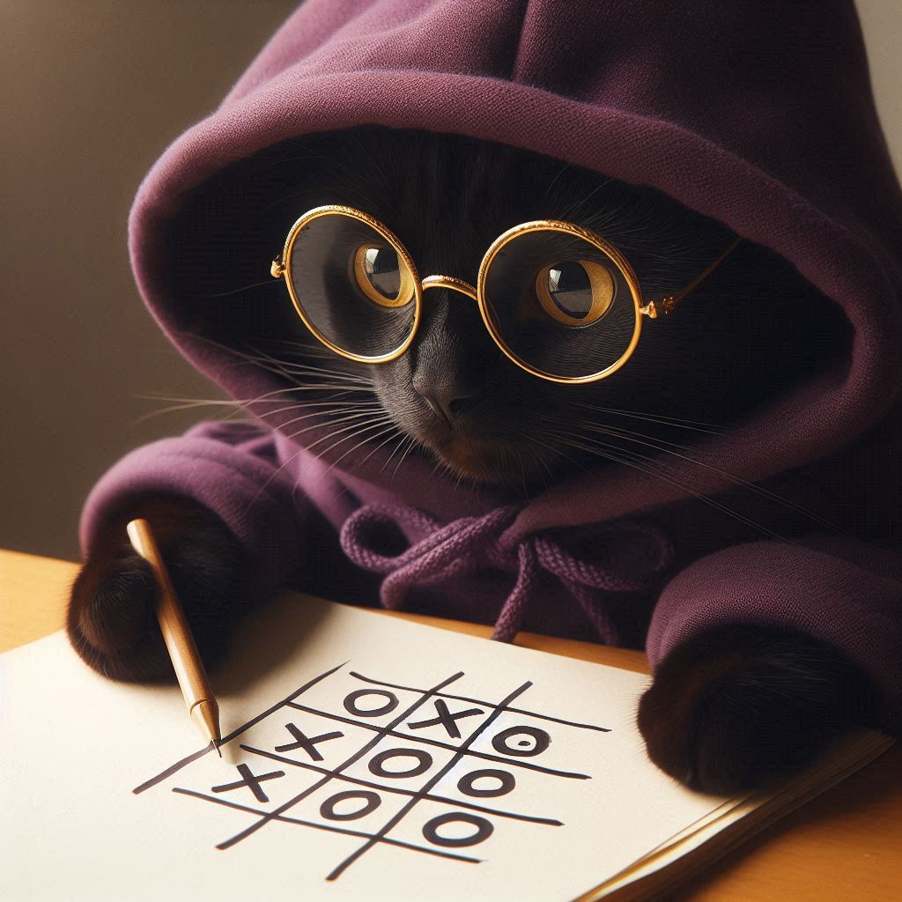

# Tic Tac Toe



*Image created using Microsoft's AI Image Generator*

## Overview
Tic Tac Toe is a classic two-player game where players take turns marking a space in a 3x3 grid. The objective is to be the first to get three of their marks in a row, either horizontally, vertically, or diagonally. This project implements the game using Java, focusing on multi-dimensional arrays and graphical output through the `DrawingPanel` utility.

## Features
- **Regular Tic Tac Toe**: A standard 3x3 Tic Tac Toe game where two players can take turns.
- **Advanced Tic Tac Toe**: An extended version of the game played on a 4x4 grid with additional win conditions.
- **Artificial Intelligence**: An AI opponent that plays against the user, designed to always force a draw.
- **User Input Handling**: Prompts users for their moves and validates input.
- **Graphical Interface**: Utilizes the `DrawingPanel` class to visually represent the game board.

## Usage
- The game initializes with an empty **3x3 grid**.
- Players take turns entering their moves by specifying the row and column.
- The game continues until one player wins or the game ends in a draw.
- The winner is announced at the end of the game.

## Installation
1. Ensure you have **Java 8 or higher** installed.
2. Clone this repository:
   ```sh
   git clone https://github.com/CeliePierre/Tic-Tac-Toe.git
   cd ConcentratTic-Tac-Toeion
   ```
3. Compile the Java files:
   ```sh
   javac TicTac.java TicTacAI.java TicTacPlus.java
   ```
4. Run the program:
    - Run the `TicTac` file to play the regular Tic Tac Toe game.
        ```sh
        java TicTac
        ```
    - For the advanced version, run the `TicTacPlus` file.
        ```sh
        java TicTacPlus
        ```
    - To play against the AI, run the `TicTacAI` file.
        ```sh
        java TicTacAI
        ```


## License
This project is for educational purposes and does not require a license.
